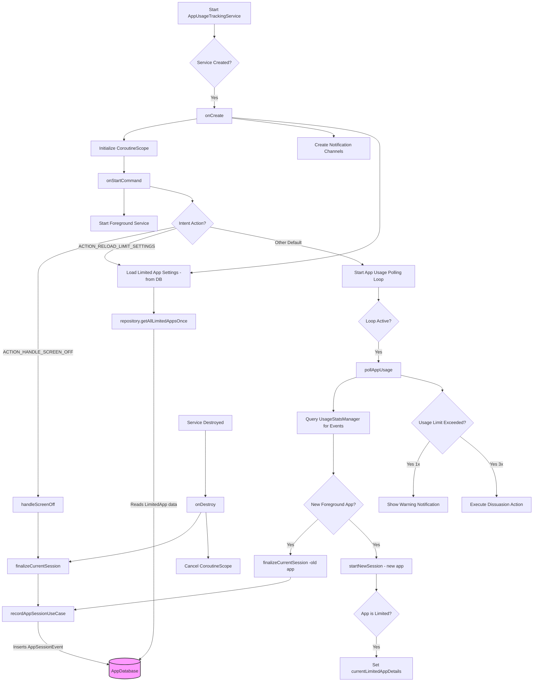

**Explanation:**
This diagram illustrates the main flow of the `AppUsageTrackingService`.
- The service starts and initializes, loading app limit settings from the database.
- It then enters a continuous polling loop to monitor foreground app changes.
- When an app changes or the screen turns off, the `finalizeCurrentSession` function is called to save the previous app's session data to the database.
- If the currently used app is a limited app, the service checks its continuous usage against the set limits and triggers notifications or dissuasion actions as needed.
- The service interacts with the `AppDatabase` primarily through the `TrackerRepository` to `getAllLimitedAppsOnce()` and `recordAppSessionUseCase()`.