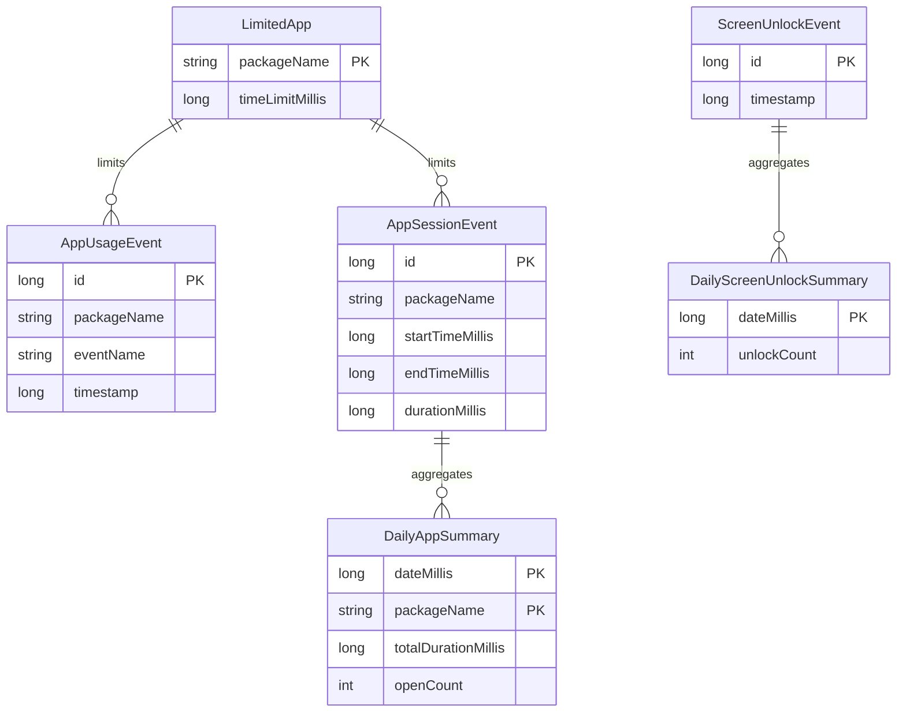

**Note:** The relationships shown above are conceptual based on how data is processed and aggregated within the application. Room (the ORM used) does not explicitly define foreign key constraints in the entity classes themselves for these relationships, but rather manages them through queries and data processing logic.